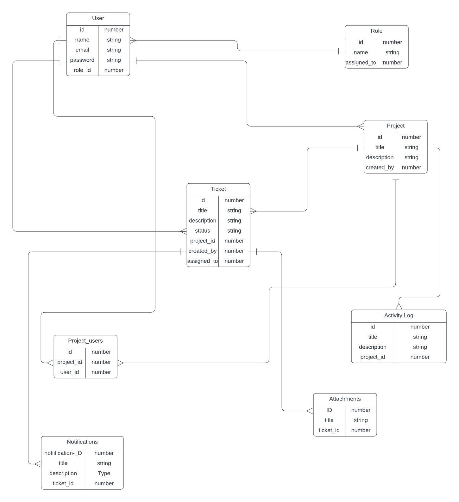

# Bug Tracking Application

## Project Overview
The goal of this project is to build a bug tracking application that allows teams to track, manage, and resolve bugs or issues in their projects. The application should be intuitive, user-friendly, and efficient in handling bug reports.

## Functional Requirements

### 1. User Management
- **Sign Up, Login, and Logout**: Users can sign up, log in, and log out of the application.
- **User Roles**: The system supports different user roles, including:
  - **Admin**: Full access to all features, including managing users and roles.
  - **Developer**: Can view and manage assigned bugs, update bug statuses, and add comments.
  - **Tester**: Can report bugs, comment on bugs.

### 2. Project Management
- **Project Creation**: Users can create and manage multiple projects, each having the following details:
  - Title
  - Description
  - Start Date
  - End Date
- **User Assignment to Projects**: Users can be assigned to projects with specific roles, such as Developer or Tester.

### 3. Bug Reporting and Tracking
- **Create Bug Reports**: Users can create bug reports that include:
  - Title
  - Description
  - Severity (Low, Medium, High, Critical)
  - Status (Open, In Progress, Resolved, Closed)
  - Assigned Developer
  - Attachments (screenshots, logs, videos)
- **Comments**: Users can comment on bugs for discussion, updates, and sharing information.

### 4. Notification System
- **Bug Assignment Notifications**: Users will receive notifications when a bug is assigned to them.
- **Status Change Notifications**: Notifications will be sent when the status of a bug is updated.
- **Comment Notifications**: Users will receive notifications when new comments are added to bugs.

### 6. Activity Log
- **Track Actions**: The application records all activities such as bug creation, status changes, and updates.

### 7. Integration and API
- **RESTful API**: The system provides basic RESTful API endpoints for CRUD operations on users, projects, and bugs.
---

## Database Schema

Here is the database schema for the bug tracking application:

## Technologies Used
- **Frontend**: React.js
- **Backend**: Node.js, Express
- **Database**: PostgreSQL
- **Authentication**: JWT (JSON Web Tokens)
